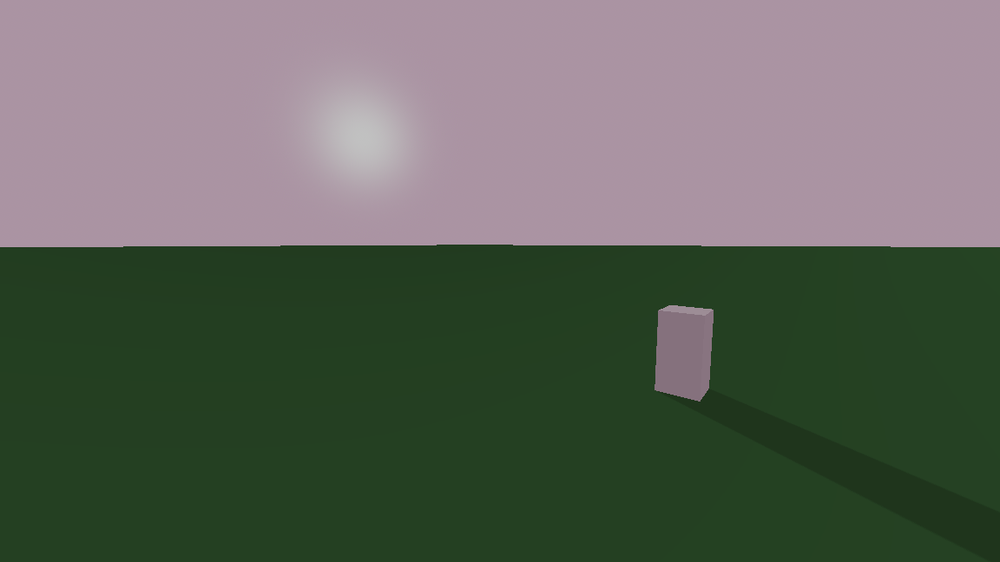

# Day & Night Cycle (Godot plugin)

Adds an easy-to-use, customizable day & night cycle for Godot 4 projects.

## Features
- Smooth day/night transitions using gradients and curves
- Separate presets for day and night phases
- Controls DirectionalLight3D and WorldEnvironment sky material
- Signals for phase changes (day_started, night_started)

## Preview

## Installation

1. Copy the `addons/day_and_night_cycle` folder into your project's `addons/` folder (already included in this repository).
2. In Godot, open Project Settings -> Plugins and enable `Day & Night Cycle`.

## Quick start

1. Open `res://addons/day_and_night_cycle/scenes/example.tscn` to see a minimal example scene pre-wired with the `CycleController`.
2. Add the `CycleController` node to your scene (or instance the example scene) and assign the following exported properties in the inspector:
	- `day_data` (Resource of type `CycleData`) — use the provided `presets/default_day_cycle.tres` or a custom resource.
	- `night_data` (Resource of type `CycleData`) — use `presets/default_night_cycle.tres` or your own.
	- `sun_light` (DirectionalLight3D) — the directional light used as the sun.
	- `world_environment` (WorldEnvironment) — the environment node whose ProceduralSky will be updated.

## Configuration

The plugin exposes a small, focused configuration surface via the `CycleController` node.

CycleData resource (res://addons/day_and_night_cycle/scripts/cycle_data.gd)
- `colors` (GradientTexture2D): Gradient that describes sky colors across the phase (left = start, right = end).
- `length` (float): Duration of the phase in seconds.
- `light_energy` (Curve): Curve controlling the sun light energy across the phase.

CycleController node (res://addons/day_and_night_cycle/scripts/cycle_controller.gd)
- `day_data` (CycleData): Resource used for the day phase.
- `night_data` (CycleData): Resource used for the night phase.
- `sun_light` (DirectionalLight3D): Directional light whose rotation and energy will be controlled.
- `world_environment` (WorldEnvironment): Environment node that must contain a `ProceduralSky` material. The plugin will update top/horizon/ground colors.
- `show_debug_time` (bool): When enabled, prints the current cycle/time debug info to the console.

Runtime API (methods & signals)

## Signals
- `day_started` — emitted when day begins.
- `night_started` — emitted when night begins.

## Methods
- `get_current_time_formatted() -> String` — returns a HH:MM:SS formatted string of the current cycle time.
- `get_day_progress() -> float` — returns normalized progress for the current phase (0.0–1.0).
- `set_time_of_day(progress: float)` — set time of day as a normalized progress over the full cycle (0.0 start of day, 1.0 end of night).
- `skip_to_day()` — jump to the start of day.
- `skip_to_night()` — jump to the start of night.

## Example scene

- `addons/day_and_night_cycle/scenes/example.tscn` shows a minimal setup with a `DirectionalLight3D`, a `WorldEnvironment` with a `ProceduralSky` and a simple ground mesh. Use this to see the cycle in action.

## Presets

- `addons/day_and_night_cycle/presets/default_day_cycle.tres` — sample day gradient and light energy curve (length 60s).
- `addons/day_and_night_cycle/presets/default_night_cycle.tres` — sample night gradient and light energy curve (length 60s).

## Tips & troubleshooting

- If sky colors don't update, ensure the assigned `WorldEnvironment.environment.sky.sky_material` is a `ProceduralSkyMaterial` (the plugin updates properties on the material directly).
- If `sun_light` is not assigned the plugin will error — attach a `DirectionalLight3D` from your scene.
- For finer control over the sun's color and more advanced atmospheric scattering, combine this plugin with a dedicated sky shader or environment setup.

## Development

The plugin code lives under `addons/day_and_night_cycle/`:

- `day_and_night_cycle.gd` — editor plugin bootstrap (currently minimal/stubbed).
- `scripts/cycle_controller.gd` — main controller node.
- `scripts/cycle_data.gd` — `Resource` class used for presets.
- `presets/` — example `CycleData` resources.
- `scenes/example.tscn` — example scene demonstrating the plugin.

## License

This repository includes a LICENSE file. Check `LICENSE` at the project root for full terms.

## Contributing

Contributions, bug reports and pull requests are welcome. If you open an issue, please include Godot version and a short reproduction project if possible.